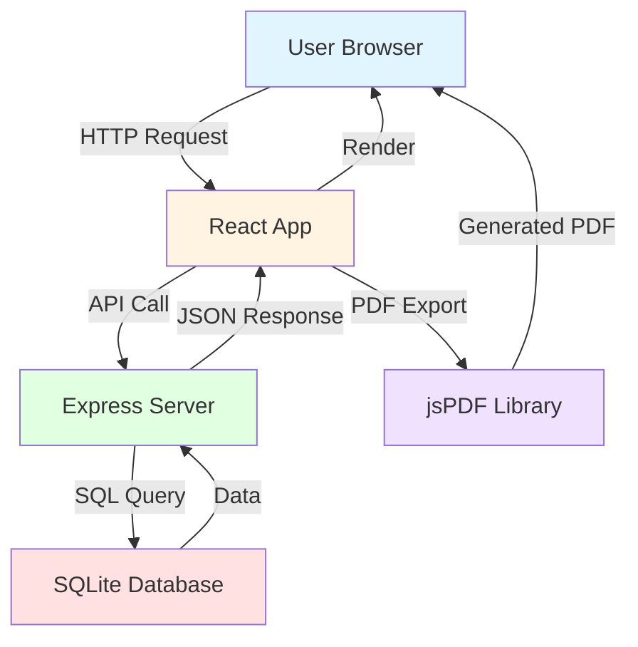

# MEDDIC Deal Health Check - Technical Architecture & Implementation Plan

## Executive Summary

This document outlines the technical architecture for a MEDDIC Deal Health Check web application - a single-user, localhost-based tool that replicates Excel spreadsheet functionality with a modern web interface.

---

## 1. Technology Stack Recommendation

### Frontend
- **React 18** - Component-based UI library
- **TypeScript** - Type safety and better developer experience
- **Tailwind CSS** - Utility-first CSS framework for rapid UI development
- **React Router** - Client-side routing
- **React Hook Form** - Form state management and validation
- **jsPDF + jsPDF-AutoTable** - PDF export functionality
- **date-fns** - Date manipulation and formatting

### Backend
- **Node.js 18+** - JavaScript runtime
- **Express.js** - Lightweight web framework
- **SQLite3** - Embedded database (perfect for single-user, local deployment)
- **CORS** - Cross-origin resource sharing middleware

### Development Tools
- **Vite** - Fast build tool and dev server
- **ESLint + Prettier** - Code quality and formatting
- **Concurrently** - Run frontend and backend simultaneously

### Why This Stack?

1. **Single Language**: JavaScript/TypeScript across the entire stack
2. **Zero Configuration Database**: SQLite requires no separate database server
3. **Fast Development**: Vite provides instant hot module replacement
4. **Simple Deployment**: Everything runs locally with `npm start`
5. **Modern & Maintainable**: Industry-standard tools with excellent documentation
6. **Lightweight**: Minimal dependencies, fast startup time

---

## 2. Project Structure

```
MEDDIC_Application/
├── client/                      # Frontend React application
│   ├── public/
│   │   └── favicon.ico
│   ├── src/
│   │   ├── components/          # Reusable UI components
│   │   │   ├── common/          # Generic components (Button, Input, etc.)
│   │   │   ├── layout/          # Layout components (Header, Sidebar, etc.)
│   │   │   └── deals/           # Deal-specific components
│   │   │       ├── DealList.tsx
│   │   │       ├── DealCard.tsx
│   │   │       ├── DealForm.tsx
│   │   │       └── DealFilters.tsx
│   │   ├── pages/               # Page components
│   │   │   ├── Dashboard.tsx
│   │   │   ├── DealDetail.tsx
│   │   │   └── NotFound.tsx
│   │   ├── services/            # API service layer
│   │   │   └── api.ts
│   │   ├── types/               # TypeScript type definitions
│   │   │   └── deal.types.ts
│   │   ├── utils/               # Utility functions
│   │   │   ├── formatters.ts
│   │   │   ├── validators.ts
│   │   │   └── pdfExport.ts
│   │   ├── hooks/               # Custom React hooks
│   │   │   └── useDeals.ts
│   │   ├── App.tsx              # Main app component
│   │   ├── main.tsx             # Entry point
│   │   └── index.css            # Global styles
│   ├── package.json
│   ├── tsconfig.json
│   ├── vite.config.ts
│   └── tailwind.config.js
│
├── server/                      # Backend Express application
│   ├── src/
│   │   ├── controllers/         # Request handlers
│   │   │   └── dealController.js
│   │   ├── models/              # Database models
│   │   │   └── dealModel.js
│   │   ├── routes/              # API routes
│   │   │   └── dealRoutes.js
│   │   ├── middleware/          # Express middleware
│   │   │   ├── errorHandler.js
│   │   │   └── validator.js
│   │   ├── config/              # Configuration files
│   │   │   └── database.js
│   │   ├── utils/               # Utility functions
│   │   │   └── helpers.js
│   │   └── server.js            # Express app setup
│   ├── database/                # SQLite database files
│   │   └── meddic.db            # (auto-generated)
│   └── package.json
│
├── docs/                        # Documentation
│   ├── API.md                   # API documentation
│   └── USER_GUIDE.md            # User guide
│
├── .gitignore
├── README.md
└── package.json                 # Root package.json for scripts
```

---

## 3. Database Schema Design

### Deals Table

```sql
CREATE TABLE deals (
    id INTEGER PRIMARY KEY AUTOINCREMENT,
    
    -- Basic Information
    company_name TEXT NOT NULL,
    opportunity_description TEXT,
    why_ibm TEXT,
    project_name TEXT,
    business_owner TEXT,
    close_date TEXT,
    value_usd REAL,
    
    -- MEDDIC Fields
    metric TEXT,
    economic_buyer TEXT,
    decision_criteria TEXT,
    decision_process TEXT,
    identified_pain TEXT,
    champion TEXT,
    competition TEXT,
    
    -- Action Items
    next_actions TEXT,
    action_date TEXT,
    action_owner TEXT,
    
    -- Metadata
    created_at TEXT NOT NULL DEFAULT CURRENT_TIMESTAMP,
    updated_at TEXT NOT NULL DEFAULT CURRENT_TIMESTAMP
);

CREATE INDEX idx_company_name ON deals(company_name);
CREATE INDEX idx_close_date ON deals(close_date);
CREATE INDEX idx_created_at ON deals(created_at);
```

### Schema Rationale

- **Single Table Design**: All deal data in one table for simplicity
- **TEXT Fields**: Flexible for long-form content (descriptions, notes)
- **REAL for Currency**: Supports decimal values for deal amounts
- **Timestamps**: Track creation and modification times
- **Indexes**: Optimize common queries (search by company, sort by date)
- **Auto-increment ID**: Simple primary key strategy

---

## 4. API Design

### RESTful Endpoints

```
Base URL: http://localhost:3001/api

GET    /deals              # Get all deals (with optional filters)
GET    /deals/:id          # Get single deal by ID
POST   /deals              # Create new deal
PUT    /deals/:id          # Update existing deal
DELETE /deals/:id          # Delete deal
GET    /deals/search?q=    # Search deals by company name or description
```

### Request/Response Examples

**GET /deals**
```json
{
  "success": true,
  "data": [
    {
      "id": 1,
      "company_name": "Acme Corp",
      "opportunity_description": "Cloud migration project",
      "value_usd": 250000,
      "close_date": "2026-08-15",
      "metric": "Reduce infrastructure costs by 30%",
      "economic_buyer": "CTO John Smith",
      "created_at": "2026-06-01T10:30:00Z",
      "updated_at": "2026-06-01T10:30:00Z"
    }
  ],
  "count": 1
}
```

**POST /deals**
```json
{
  "company_name": "Tech Solutions Inc",
  "opportunity_description": "AI implementation",
  "value_usd": 500000,
  "close_date": "2026-09-30",
  "metric": "Increase efficiency by 40%"
}
```

---

## 5. Component Architecture

### Component Hierarchy

```
App
├── Router
    ├── Dashboard (/)
    │   ├── Header
    │   ├── DealFilters
    │   │   ├── SearchBar
    │   │   ├── DateRangePicker
    │   │   └── SortDropdown
    │   ├── DealList
    │   │   └── DealCard (multiple)
    │   │       ├── DealSummary
    │   │       └── ActionButtons
    │   └── CreateDealButton
    │
    └── DealDetail (/deals/:id)
        ├── Header
        ├── DealForm
        │   ├── BasicInfoSection
        │   ├── MEDDICSection
        │   ├── ActionItemsSection
        │   └── FormActions
        └── ExportButton
```

### Key Components Description

#### Dashboard Page
- **Purpose**: Main landing page showing all deals
- **Features**: Search, filter, sort, create new deal
- **Layout**: Grid/table view of deal cards

#### DealCard Component
- **Purpose**: Display deal summary in list view
- **Data**: Company name, value, close date, MEDDIC status
- **Actions**: View, Edit, Delete buttons

#### DealForm Component
- **Purpose**: Create/edit deal with all MEDDIC fields
- **Features**: Form validation, auto-save draft, date pickers
- **Layout**: Multi-section form matching spreadsheet structure

#### DealFilters Component
- **Purpose**: Filter and search deals
- **Features**: Text search, date range, value range, sort options

---

## 6. UI/UX Design Approach

### Design Principles

1. **Spreadsheet Familiarity**: Layout mimics Excel for easy adoption
2. **Clean & Professional**: Minimal design, focus on data
3. **Responsive**: Works on desktop, tablet, and mobile
4. **Accessible**: Keyboard navigation, screen reader support

### Layout Structure

```
┌─────────────────────────────────────────────────────────┐
│  MEDDIC Deal Health Check        [+ New Deal] [Export]  │
├─────────────────────────────────────────────────────────┤
│  [Search...] [Filter ▼] [Sort ▼]                        │
├─────────────────────────────────────────────────────────┤
│  ┌───────────────────────────────────────────────────┐  │
│  │ Acme Corp                          $250,000       │  │
│  │ Cloud Migration Project            Close: Aug 15  │  │
│  │ MEDDIC: ●●●●○○ (4/6 complete)     [View] [Edit]  │  │
│  └───────────────────────────────────────────────────┘  │
│  ┌───────────────────────────────────────────────────┐  │
│  │ Tech Solutions Inc                 $500,000       │  │
│  │ AI Implementation                  Close: Sep 30  │  │
│  │ MEDDIC: ●●●○○○ (3/6 complete)     [View] [Edit]  │  │
│  └───────────────────────────────────────────────────┘  │
└─────────────────────────────────────────────────────────┘
```

### Color Scheme

- **Primary**: Blue (#2563eb) - Actions, links
- **Success**: Green (#10b981) - Completed items
- **Warning**: Yellow (#f59e0b) - Pending items
- **Danger**: Red (#ef4444) - Delete actions
- **Neutral**: Gray (#6b7280) - Text, borders

---

## 7. Implementation Phases

### Phase 1: Project Setup & Infrastructure (Day 1)
**Goal**: Set up development environment and basic project structure

**Tasks**:
1. Initialize project structure (client, server, root)
2. Set up package.json files with dependencies
3. Configure TypeScript for client
4. Configure Vite build tool
5. Set up Tailwind CSS
6. Create basic Express server
7. Initialize SQLite database with schema
8. Set up development scripts (concurrent frontend/backend)
9. Create .gitignore and README

**Deliverables**:
- Working dev environment
- Empty React app running on port 3000
- Express server running on port 3001
- SQLite database created

---

### Phase 2: Backend API Development (Day 2)
**Goal**: Build complete REST API for deal management

**Tasks**:
1. Create database connection module
2. Implement deal model with CRUD operations
3. Build deal controller with business logic
4. Create API routes
5. Add input validation middleware
6. Implement error handling
7. Add search and filter functionality
8. Test all endpoints with Postman/Thunder Client

**Deliverables**:
- Fully functional REST API
- All CRUD operations working
- Search and filter capabilities
- Error handling in place

---

### Phase 3: Frontend Core Components (Day 3)
**Goal**: Build reusable UI components and routing

**Tasks**:
1. Set up React Router
2. Create layout components (Header, Container)
3. Build common components (Button, Input, Card)
4. Create TypeScript types for Deal
5. Implement API service layer
6. Create custom hooks (useDeals, useForm)
7. Build loading and error states

**Deliverables**:
- Component library ready
- API integration layer complete
- Routing configured
- Type safety established

---

### Phase 4: Dashboard & Deal List (Day 4)
**Goal**: Implement main dashboard with deal listing

**Tasks**:
1. Create Dashboard page component
2. Build DealList component
3. Implement DealCard component
4. Add search functionality
5. Implement filter controls
6. Add sort functionality
7. Create "New Deal" button
8. Style with Tailwind CSS
9. Add responsive design

**Deliverables**:
- Working dashboard
- Deal list with cards
- Search, filter, sort working
- Responsive layout

---

### Phase 5: Deal Form & CRUD Operations (Day 5)
**Goal**: Complete deal creation and editing functionality

**Tasks**:
1. Create DealDetail page
2. Build DealForm component
3. Implement form sections (Basic Info, MEDDIC, Actions)
4. Add form validation with React Hook Form
5. Implement create deal functionality
6. Implement update deal functionality
7. Add delete confirmation modal
8. Handle form submission and errors
9. Add success/error notifications

**Deliverables**:
- Full CRUD functionality
- Form validation working
- User feedback on actions
- Data persistence confirmed

---

### Phase 6: PDF Export & Polish (Day 6)
**Goal**: Add PDF export and final polish

**Tasks**:
1. Implement PDF export with jsPDF
2. Format PDF to match spreadsheet layout
3. Add MEDDIC scoring visualization
4. Implement date formatting utilities
5. Add currency formatting
6. Polish UI/UX details
7. Add loading states
8. Improve error messages
9. Add keyboard shortcuts
10. Test all features end-to-end

**Deliverables**:
- PDF export working
- Professional formatting
- Polished user experience
- All features tested

---

### Phase 7: Documentation & Deployment (Day 7)
**Goal**: Complete documentation and prepare for use

**Tasks**:
1. Write API documentation
2. Create user guide
3. Add inline code comments
4. Write README with setup instructions
5. Create startup scripts
6. Test fresh installation
7. Document known issues
8. Create backup/restore guide

**Deliverables**:
- Complete documentation
- Easy setup process
- User guide ready
- Production-ready application

---

## 8. Dependencies & Setup Requirements

### System Requirements

- **Node.js**: Version 18.x or higher
- **npm**: Version 9.x or higher
- **Operating System**: macOS, Windows, or Linux
- **Browser**: Modern browser (Chrome, Firefox, Safari, Edge)
- **Disk Space**: ~500MB for node_modules

### Installation Steps

```bash
# 1. Navigate to project directory
cd /Users/jasonkurniawan/Documents/Bob/MEDDIC_Application

# 2. Install root dependencies
npm install

# 3. Install client dependencies
cd client
npm install
cd ..

# 4. Install server dependencies
cd server
npm install
cd ..

# 5. Initialize database
npm run init-db

# 6. Start development servers
npm run dev
```

### Key Dependencies

**Client (Frontend)**
```json
{
  "react": "^18.2.0",
  "react-dom": "^18.2.0",
  "react-router-dom": "^6.20.0",
  "react-hook-form": "^7.49.0",
  "typescript": "^5.3.0",
  "tailwindcss": "^3.4.0",
  "jspdf": "^2.5.1",
  "jspdf-autotable": "^3.8.0",
  "date-fns": "^3.0.0",
  "axios": "^1.6.0"
}
```

**Server (Backend)**
```json
{
  "express": "^4.18.0",
  "sqlite3": "^5.1.0",
  "cors": "^2.8.5",
  "dotenv": "^16.3.0",
  "express-validator": "^7.0.0"
}
```

**Development Tools**
```json
{
  "vite": "^5.0.0",
  "concurrently": "^8.2.0",
  "nodemon": "^3.0.0",
  "eslint": "^8.55.0",
  "prettier": "^3.1.0"
}
```

---

## 9. Data Flow Architecture



### Request Flow Example

1. **User Action**: User clicks "View Deal" button
2. **React Component**: DealCard triggers navigation
3. **React Router**: Routes to `/deals/:id`
4. **API Service**: Calls `GET /api/deals/:id`
5. **Express Route**: Receives request, validates ID
6. **Controller**: Calls model method
7. **Model**: Executes SQL query on SQLite
8. **Database**: Returns deal data
9. **Response Chain**: Data flows back through layers
10. **React Component**: Renders DealForm with data

---

## 10. Security Considerations

Even for a single-user local application, basic security practices:

1. **Input Validation**: Validate all user inputs on backend
2. **SQL Injection Prevention**: Use parameterized queries
3. **XSS Prevention**: Sanitize user input before rendering
4. **CORS Configuration**: Restrict to localhost origins
5. **Error Handling**: Don't expose sensitive error details
6. **Data Backup**: Regular SQLite database backups

---

## 11. Testing Strategy

### Manual Testing Checklist

**CRUD Operations**
- [ ] Create new deal with all fields
- [ ] Create deal with minimal fields
- [ ] Read/view deal details
- [ ] Update existing deal
- [ ] Delete deal with confirmation

**Search & Filter**
- [ ] Search by company name
- [ ] Search by description
- [ ] Filter by date range
- [ ] Sort by value, date, company

**PDF Export**
- [ ] Export single deal
- [ ] Verify PDF formatting
- [ ] Check all fields included

**UI/UX**
- [ ] Responsive on different screen sizes
- [ ] Form validation messages
- [ ] Loading states
- [ ] Error handling
- [ ] Navigation flow

---

## 12. Future Enhancements (Post-MVP)

Potential features for future versions:

1. **Multi-user Support**: Add authentication and user management
2. **Deal Scoring**: Automatic MEDDIC score calculation
3. **Analytics Dashboard**: Charts and metrics
4. **Email Notifications**: Reminders for close dates
5. **File Attachments**: Upload documents per deal
6. **Activity Log**: Track all changes to deals
7. **Excel Import**: Import existing spreadsheets
8. **Cloud Sync**: Optional cloud backup
9. **Mobile App**: Native iOS/Android apps
10. **API Integration**: Connect to CRM systems

---

## 13. Risk Mitigation

### Potential Risks & Solutions

| Risk | Impact | Mitigation |
|------|--------|------------|
| Data loss | High | Implement auto-save, regular backups |
| Browser compatibility | Medium | Test on major browsers, use polyfills |
| Performance with large datasets | Medium | Implement pagination, lazy loading |
| User learning curve | Low | Intuitive UI, user guide, tooltips |
| Database corruption | High | Regular backups, transaction handling |

---

## 14. Success Metrics

The MVP will be considered successful when:

1. ✅ All CRUD operations work reliably
2. ✅ Search and filter return accurate results
3. ✅ PDF export generates professional documents
4. ✅ UI is clean and matches spreadsheet layout
5. ✅ Application starts with single command
6. ✅ No data loss during normal operations
7. ✅ Responsive design works on common screen sizes
8. ✅ User can complete all tasks without documentation

---

## 15. Development Timeline

**Total Estimated Time**: 7 days (assuming 6-8 hours per day)

- **Day 1**: Setup & Infrastructure (6 hours)
- **Day 2**: Backend API (8 hours)
- **Day 3**: Frontend Components (8 hours)
- **Day 4**: Dashboard & List View (7 hours)
- **Day 5**: Deal Form & CRUD (8 hours)
- **Day 6**: PDF Export & Polish (7 hours)
- **Day 7**: Documentation & Testing (6 hours)

**Total**: ~50 hours of development time

---

## 16. Quick Start Commands

Once implemented, these commands will run the application:

```bash
# Development mode (hot reload)
npm run dev

# Production build
npm run build

# Start production server
npm start

# Database backup
npm run backup-db

# Run tests
npm test
```

---

## Conclusion

This architecture provides a solid foundation for a MEDDIC Deal Health Check application that is:

- **Simple**: Single-user, localhost deployment
- **Modern**: Current best practices and tools
- **Maintainable**: Clear structure and documentation
- **Extensible**: Easy to add features later
- **Practical**: Focused on MVP delivery

The recommended stack (React + Express + SQLite) offers the best balance of simplicity, performance, and developer experience for this use case.